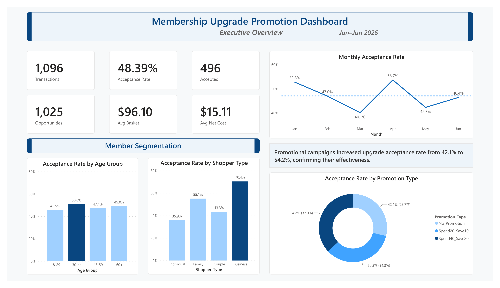
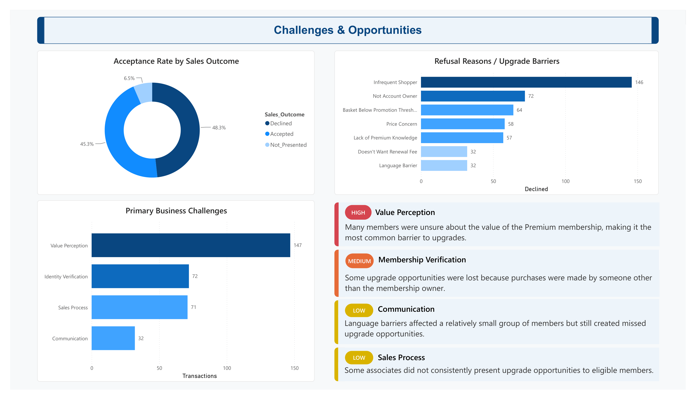
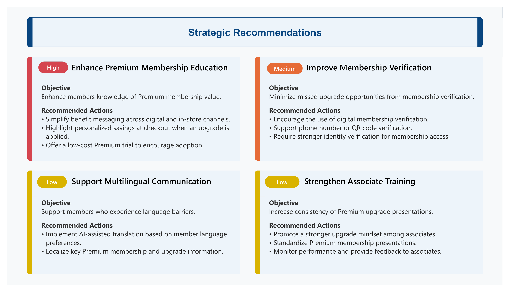
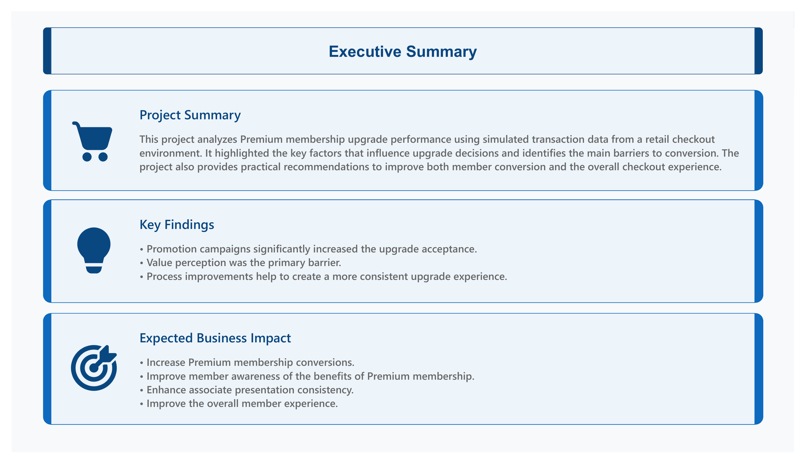

# membership-upgrade-analysis
Business analytics project using Excel, PostgreSQL, SQL, and Power BI to identify key factors influencing membership upgrade conversion.


## Project Overview
This end-to-end data analytics portfolio project analyzes simulated retail membership upgrade transactions to identify the factors that influence upgrade conversion.
It covers the complete analytics workflow, including data simulation, database design, SQL analysis, business insight development, and interactive dashboard visualization.
All data used in this project is simulated for educational and portfolio purposes.


## Business Context
This project simulates a membership-based retail program with two membership tiers: Basic Membership ($60/year) and Premium Membership ($120/year). 
Eligible members may be offered a Premium membership upgrade during checkout, with promotional discounts available throughout promotion campaigns.
Membership pricing and benefits are simplified and simulated for portfolio purposes.


## Project Objectives
- Build a realistic simulated retail transaction dataset.
- Analyze factors influencing membership upgrade conversion.
- Evaluate the effectiveness of promotional campaigns.
- Identify the primary reasons members decline an upgrade.
- Develop data-driven business recommendations.


## Tools & Technologies
| Tool       | Purpose                                         |
|------------|-------------------------------------------------|
| Excel      | Data simulation, validation, and preparation    |
| PostgreSQL | Database storage                                |
| SQL        | Data querying and business analysis             |
| Power BI   | Dashboard, visualization, and executive summary |


## Project Workflow
1. Simulate retail transaction data in Excel.
2. Import the dataset into PostgreSQL.
3. Perform business analysis using SQL.
4. Build an interactive Power BI dashboard.
5. Present key insights and business recommendations.


## Dataset
- **Time Period:** January – June (6 months)
- **Records:** 1,096 simulated transactions
- **Data Source:** Simulated for portfolio purposes
- **Key Variables:** Basket_Amount, Promotion_Type, Net_Upgrade_Cost, Sales_Outcome, Refusal_Reason


## Dashboard Preview

### Executive Overview


### Challenges & Opportunities


### Strategic Recommendations


### Executive Summary



## Key Insights
- Promotional campaigns significantly increased upgrade acceptance rates.
- Value perception was the primary barrier to membership upgrades.
- Membership verification issues contributed to missed upgrade opportunities.
- Communication barriers had a smaller but measurable impact.
- Consistent upgrade presentation by associates remains an opportunity for improvement.


## Repository Structure

```text
membership-upgrade-analysis/
│
├── assets/
│   └── icons/                                        # Power BI icons and visual resources
│
├── data/
│   ├── transactions.csv                              # Analysis dataset
│   └── transactions_sql.csv                          # PostgreSQL import dataset
│
├── excel/
│   ├── Membership_Promotion_Analysis.xlsx            # Analysis workbooks with dashboard data and data dictionary
│   ├── Membership_Promotion_Data_Generator.xlsx      # Data generator with simulation logic
│   └── simulation_data/
│       ├── Basket_Amount.xlsx                        # Basket amount simulation workbook
│       └── Upgrade_Fee.xlsx                          # Upgrade fee simulation workbook
│
├── images/                                           # Power BI dashboard images
│   ├── Executive_Overview.png
│   ├── Challenges&Opportunities.png
│   ├── Strategic_Recommendations.png
│   └── Executive_Summary.png
│
├── powerbi/
│   ├── Membership_Project_Dashboard.pbix             # Interactive Power BI dashboard
│   └── Membership_Project_Dashboard.pdf              # PDF version of the dashboard
│
├── sql/                                              # SQL scripts for data analysis
│   ├── 01_create_table.sql
│   ├── 02_import_data.sql
│   ├── ...
│   └── 13_key_findings.sql
│
├── LICENSE
└── README.md
```

## Project Guide
1. **README** — Understand the business problem, objectives, and project workflow.
2. **Dashboard Preview** — Review the Power BI dashboard screenshots.
3. **Power BI Dashboard** — Open the interactive dashboard (.pbix) for detailed analysis.
4. **SQL Scripts** — Explore the SQL queries used for KPI calculations and business analysis.
5. **Excel Workbooks** — Review the data generation process, data dictionary, and supporting analysis.

## Author

**Jianxuan Li**
Aspiring Data Analyst

**Skills**: Excel | SQL | PostgreSQL | Power BI | R
